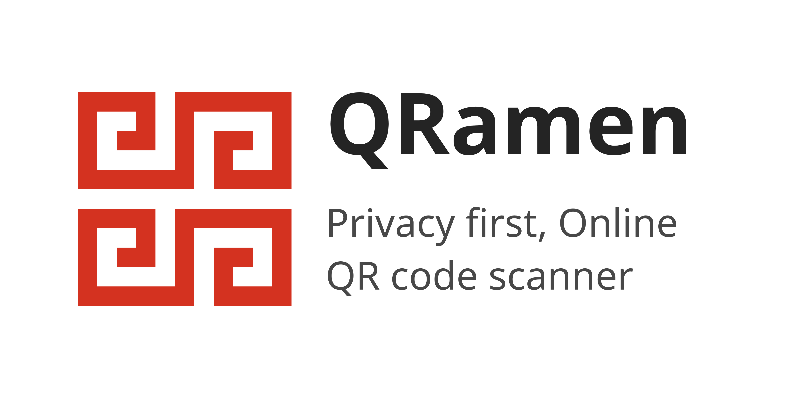

# QRamen

https://qramen.app

Privacy first online QR code scanner.

- :open_hands: Open source
- :see_no_evil: Do not send scanned data anywhere
- :metal: No need to install (It's a web application)
- :thumbsup: Works offline

## Motivation

The main motivation is for Android phone.  
There're a lot of QR scanner app in the Google Play Store as there's no QR code scanner in the Android Camera app.

And popular QR scanner apps in the store sometimes become "evil". And it is not easy to verify whether the app we're using now is evil or not. I need a non-evil QR code scanner.

## License

This repository is under [MIT](./LICENSE) license.
